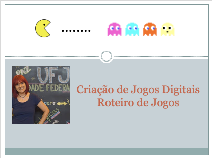

## Aula 01 - Roteiro de Jogos

> Atividades da aula - Introdução ao Projeto de Jogos

## Principais elementos para o desenvolvimento de um projeto de jogo

- Princípios básicos, conceito de diversão, design de games, ciclo de desenvolvimento de um game

### Roteiro Aula
- [ ] Conduzindo o pensamento para entender o que é um game
- [ ] O que é gameplay: é o que acontece entre o início e o final de um game – desde o momento em que você aprende quais são os seus objetivos até atingir a vitória ou o fracasso no final.
- [ ] Conceito de diversão: quatro componentes: receptividade, expectativa, seus gostos subjetivos, "ingrediente X"
- [ ] Design de games, uma comparação de construção de casa sem projeto. Imagine os jogos atuais sem um projeto
- [ ] O ciclo de desenvolvimento: Pré-produção, Produção e Pós-Produção

### Material
[Notas de aula](/documentos/roteiro_de_jogos.pdf)

### Videoaula Criação de Jogos Digitais -  Roteiro de Jogos

