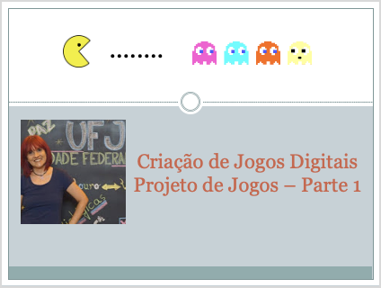

## Aula - Projeto de Jogos - Parte 1 e Parte 2

> Atividades da aula - Construindo o Conceito do Jogo, Qual a motivação para o desenvolvimento do Jogo, Como devo começar, meu primeiro roteiro

## Conceitos trabalhados nesta aula

- Conceito do Jogo: Quando, Onde, Quem, Porque, O que, Como, Título
- Idéia Original: Como surge uma ideia de jogo? Como trabalhar esta ideia
- Desenvolvendo meu primeiro roteiro

### Roteiro Aula - Projeto de Jogos - Parte 1
- [ ] Conduzindo o pensamento sobre motivações para desenvolver um game
- [ ] Discussão sobre a necessidade de desenvolvimento de um roteiro de jogos. Será mesmo necessário? Discussão em sala.
- [ ] Desenvolvendo o Conceito do Jogo
- [ ] Para desenvolver o conceito é necessário definir alguns pontos: Quando? Onde? Quem? Porque? O que? Como? Título - Refletir sobre cada um destes pontos
- [ ] Ideia Original

### Roteiro Aula - Projeto de Jogos - Parte 2
- [ ] Meu primeiro roteiro
- [ ] Game Design Canvas - Discutir cada etapa de desenvolvimento

### Material
[Notas de aula](/documentos/03_projeto_de_jogos_parte1_e_parte2.pdf)

### Videoaulas Criação de Jogos Digitais -  Projeto de Jogos Parte 1 e Parte 2

