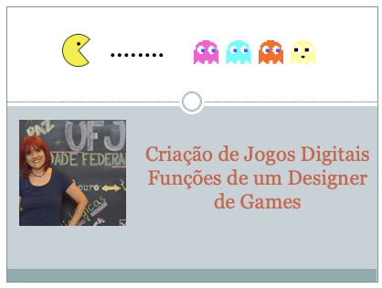

## Aula - Funções de um Projetista de Jogos (Designer de Games)

> Atividades da aula - Nesta aula será discutido sobre as principais funções de um designer de games e habilidades necessárias para este profissional. 
> Peguntas motivadoras: Será que o trabalho do designer termina após o término da escrita do documento de design? Será que a função de um designer é apenas ter ideias geniais?

## Conceitos trabalhados nesta aula

- Principais Funções de um Designer de Games: Pensador Criativo, Comunicador, Escritor, Líder de Torcida, Técnico, Fonte de novas ideias, Jogador de games
- Habilidades de um designer de games: Coletar e registrar informações.

### Roteiro Aula - Funções de um Designer de Games
- [ ] Qual a participação de um designer de games em um projeto? 
- [ ] Qual o período de participação
- [ ] Saber ouvir
- [ ] Saber escrever e se expressar
- [ ] Um líder motivador (Líder de torcida)
- [ ] Visualização do gameplay, uso de protótipos
- [ ] Criação de scripts com falas, cenas, transição de nível, missões
- [ ] Quando o documento está pronto?
- [ ] Como ouvir com atenção?
- [ ] A história de Truman Capote na escrita de A sangue frio.
- [ ] Como escrever com precisão e de forma inteligível?
- [ ] Leitura, um hábito necessário
- [ ] Como anotar e criar mapas mentais para registro?
- [ ] Pesquisar para ter games precisos, caso seja necessário
- [ ] Como escrever com precisão e de forma inteligível?
- [ ] Jogar, e jogar... Necessário para entender os jogos disponíveis. Jogos bons e ruins.
- [ ] Entender a tecnologia de implementação

### Material
- [Notas de aula](/documentos/04_funcoes_projetista.pdf)

### Videoaula Criação de Jogos Digitais -  Funções de um projetista

