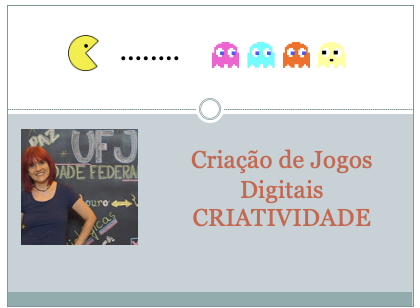

## Aula 08 - Criatividade

> Atividades da aula - Nesta aula será apresentada a importância da criatividade na profissão designer de games. 

## Conceitos trabalhados nesta aula

- O que é criatividade
- Como desenvolver a criatividade
- Atividades para desenvolvimento desta habilidade

### Roteiro Aula - Funções de um Designer de Games
- [ ] O que é criatividade
- [ ] Dicas para desenvolver a criatividade
- [ ] Fazer associações inovadoras 
- [ ] Lista de objetos e ações e unir os conceitos de forma criativa e inovadora
- [ ] Brainstorming: Uma técnica para muitas ideias e que podem ser combinadas
- [ ] Atividades para o desenvolvimento da criatividade

### Material
- [Notas de aula](/documentos/criatividade.pdf)

### Videoaula Criação de Jogos Digitais -  Funções de um projetista

