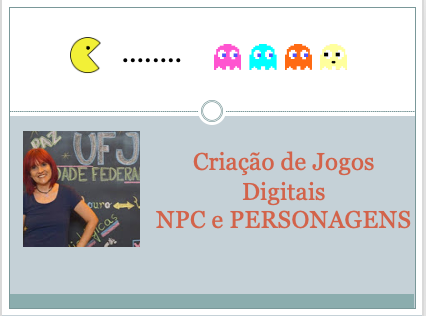

## NPC (Personagens não Jogadores) e Personagens

> Atividades da aula - Nesta aula serão apresentados os conceitos sobre NPC, tipos de personagens e arquétipos de personagens, será proposta uma atividade para o aluno fazer um personagem com suas características.

## Conceitos trabalhados nesta aula

- NPC
- Tipos de personagens
- Arquétipos de Personagens

### Roteiro Aula - NPC (Personagens não Jogadores) e Personagens
- [ ] Personagens não jogadores são aqueles que não são controlados pelos jogadores no mundo do game
- [ ] NPC são criados e controlados pelo mecanismo de IA
- [ ] Tipos de personagens: Animais, Fictícios, Históricos, Licenciados e Míticos
- [ ] Arquétipos é um conceito da psicologia para representar padrões de comportamento associados a um personagem ou papel social. 
- [ ] Arquétipos de personagens: Herói, Sombra, Mentor, Aliado, Trapaceiro, mensageiro, Guardião.
- [ ] Atividade: Se tivesse que criar um personagem baseado em si próprio, qual seria sua aparência? Descreva-se em termos de um personagem de game. Quais são as suas características físicas e de personalidade, seus objetivos, seus pontos fortes e fracos, suas preferências e antipatias, seu estado de espírito geral? Discuta outros personagens que poderiam aparecer no game. (Obs. Esses personagens não precisam necessariamente ser seus aliados; eles podem representar obstáculos que o impedem de atingir seus objetivos.

### Material
- [Notas de aula](/documentos/NPC_PERSONAGENS.pdf)

### Videoaula Criação de Jogos Digitais -  Percepções e Emoções de um Jogador

