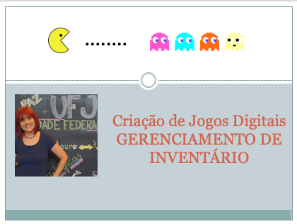

## Gerenciamento de Inventário e PowerUps

> Atividades da aula - nesta aula serão apresentados as principais características para um bom gerenciamento de inventário e powerups 

## Conceitos trabalhados nesta aula

- Como deve funcionar o gerenciamento de inventário
- Como apresentar e gerir powerups
- Atividade inventário

### Roteiro Aula - Gerenciamento de Inventário e PowerUps
- [ ] O que são itens de inventário
- [ ] O que são powerups
- [ ] Como o designer de games deve organizar o inventário, levando em consideração a usabilidade e melhor satisfação do jogador
- [ ] Evitar o tetris de inventário, ou seja, que o jogador deve ficar organizando o inventário para entender os itens que possui
- [ ] Itens de jogador: são objetos encontrados no mundo e que são pegos pelo jogador e adicionados a algum tipo de sistema de gerenciamento de inventário.
- [ ] Powerups: são ativados no momento em que são pegos e possuem apenas um efeito de curto prazo ou imediato.
- [ ] Atividade: No seu game favorito, faça uma análise do gerenciamento de inventário. Se você tivesse que melhorar algo neste gerenciamento, o que faria? Por quê? 

### Material
- [Notas de aula](/documentos/gerenciamento_inventario.pdf)

### Videoaula Criação de Jogos Digitais -  Gerenciamento de Inventário e PowerUps

